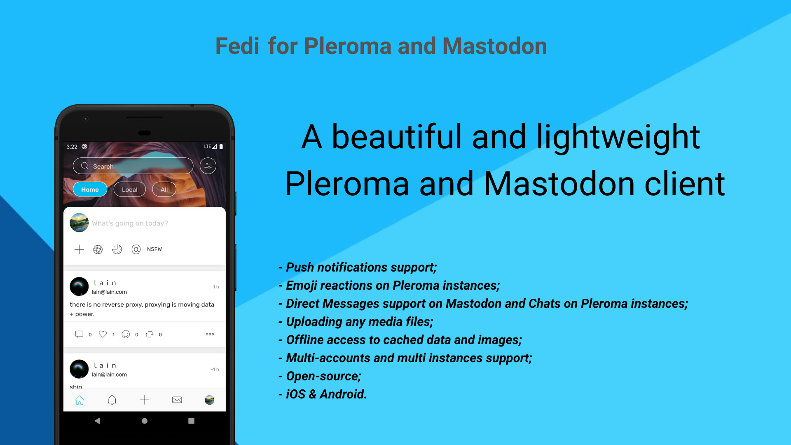

# Fedi for Pleroma and Mastodon
[](https://translate.pleroma.social/engage/fedi-app/)
[](https://github.com/Big-Fig/Fediverse.app/actions/workflows/unit_tests_with_coverage.yml/)
[](https://github.com/Big-Fig/Fediverse.app/actions/workflows/lints.yml/)
[](https://github.com/Big-Fig/Fediverse.app/actions/workflows/code_formatting.yml/)

[](https://codecov.io/gh/Big-Fig/Fediverse.app)

Fedi is open-source client for [Pleroma](https://pleroma.social/) and [Mastodon](https://joinmastodon.org/) social networks written using Flutter.

Pleroma and Mastodon are parts of [Fediverse](https://en.wikipedia.org/wiki/Fediverse) (decentralized social network). The main idea of Fediverse - nobody owns Fediverse. Anybody can run their server instance and use it to communicate with other people.

So Fedi is an open-source mobile client for social networks and has features similar to Twitter.

Follow us on Fediverse [fediapp@fedi.app](https://fedi.app/fediapp) 



- [How to find Pleroma/Mastodon instance to join?](https://github.com/Big-Fig/Fediverse.app/blob/master/helpChooseInstance.md)
- [Follow Fedi on Fediverse](https://fedi.app/fediapp)

### Android

* [Google Play](https://play.google.com/store/apps/details?id=com.fediverse.app) 
* [Google Play Beta](https://play.google.com/apps/testing/com.fediverse.app)

### iOS

* [AppStore](https://apps.apple.com/us/app/fedi-for-pleroma-and-mastodon/id1478806281) 
* [AppStore TestFlight Beta](https://testflight.apple.com/join/8z75BbeW)

### Releases

* [GitHub Releases](https://github.com/Big-Fig/Fediverse.app/releases)
* [CHANGELOG](https://github.com/Big-Fig/Fediverse.app/blob/master/CHANGELOG.md) 

### Articles about how Fedi works inside

* Part 1. [Architecture](https://medium.com/@xal_dev/fedi-flutter-open-source-social-network-client-part-1-architecture-529c45aa9f08)
* Part 2. [Code](https://medium.com/@xal_dev/fedi-flutter-open-source-social-network-client-part-2-code-8436ff2c273d)
* Part 3. [Build & Config](https://medium.com/@xal_dev/fedi-flutter-open-source-social-network-client-part-3-build-config-ebd85f26868e)
* Part 4. [Used packages](https://medium.com/@xal_dev/fedi-flutter-open-source-social-network-client-part-4-used-packages-38eebb076547)
* Part 5. [Android Studio Plugins & Feature Plans](https://medium.com/@xal_dev/fedi-flutter-open-source-social-network-client-part-5-android-studio-plugins-feature-plans-43a3d961a5bc)

### Table of Contents

* [Features](#features)
* [Coming soon](#coming-soon)
* [Known issues](#known-issues)
* [Data gathering](#data-gathering)
* [Push notifications](#push-notifications)
* [Localization](#localization)
* [License](#license)
* [Feedback](#feedback)
* [For developers](#for-developers)
  * [Flutter version &amp; FVM](#flutter-version--fvm)
  * [Libraries](#libraries)
  * [Icons](#icons)
  * [Tests](#tests)
  * [Backlog](#backlog)
  * [How to build from source](#how-to-build-from-source)

## Features

- Pleroma and Mastodon support
- Separated Pleroma & Mastodon API dart packages which you can use in your applications
- Offline mode. Access to cached data even without network
- Custom emojis. With emoji reactions support on Pleroma
- Customizable home timelines
- Multi-account support
- [Push notifications via PushRelayFCM and FCM](#push-notifications)
- Supports receive and send share intends
- Scheduled and Draft Statuses
- Filters
- Instance details, announcements, trends, activity history, limits
- Day & Night theme
- Bookmarks, Hashtags, Lists, Featured tags, Suggestions
- Messenger-like UI for Conversations(DM) and Pleroma chats
- Customizable real-time notifications & timeline updates via WebSockets and Push Notifications
- Fetch data from Remote instances via Public API. So you can access full data on remote instance if currently logged instance hasn't synchronized all data yet
- A lot of settings options(global or per-instance). For example: `Always show NSFW` or `Auto-load media content`
- Threads & Polls
- Special UI for media-only timelines
- Mutes & Blocks
- Editing profile
- Sign up support

## Coming soon

* Admin API;
* Support other Fediverse instances: Pixelfed, Misskey, Peertube, GNU Social, Friendica and others;
* Adopt UI for large screens;
* Display timelines from different instances on single Home page(currently you should switch instances to see related data);
* Remember timeline position via Markers API;
* OnBoarding & Tutorial. Popular instances suggestions;
* A lot of minor UX improvements in backlog.

Feel free to open issues if you have suggestions

## Known issues

* See [Issues](https://github.com/Big-Fig/Fediverse.app/issues)

## Data gathering

Fedi doesn't use any special analytics service to track users. 
However Fedi uses Firebase services for PushNotifications(optional) and CrashReporting(optional).

You can completely remove Firebase via manual building from source. 

### Crash reports via Firebase Crashlytics

Fedi gathers crashes and non-fatal errors to make app more stable.

* You can build app from source and remove Crashlytics library via .env config(details below)
* You can disable gathering via settings inside app(option is disabled by default)

## Push notifications

Push notifications are implemented via [toot-relay-fcm](https://github.com/Big-Fig/toot-relay-fcm) server

[PushRelayFCM](https://github.com/Big-Fig/toot-relay-fcm) is Ruby on Rails server which handles web pushes and relays them to FCM.

**From `2.5.0` version Fedi uses PushRelayFCM mode without decryption on server-side. So all private data is safe.**

PushRelayFCM and Fedi can work in two modes:
* **Without server-side decryption (`2.5.0` and newer)** - relay simple proxy encrypted messages
* **With server-side decryption (before `2.5.0`)** -decrypt messages and have access to notification content and user `access_token`. It is not used from `2.5.0` version, but is still supported in Fedi(see below why you still may want to use it).

### Without server-side decryption way
**(Used in AppStore/GooglePlay versions from `2.5.0`)**

1. Fedi subscribes to `/api/v1/push/subscription` with `subscription[endpoint]` set to relay server URL
2. Instances send web push notifications to relay server
3. PushRelayFCM **doesn't decrypt** message
4. PushRelayFCM proxies notifications to Fedi app via FCM
5. Fedi **doesn't decrypt** message and use FCM message with encrypted data as simple trigger to load latest notification via REST API (this will be improved in future releases)
6. Fedi displays notification

Since PushRelayServer doesn't know private decryption keys, it can't access any private data.

##### Pros
* **Doesn't have access to user private data**
* Uses rich notifications layouts and actions provided by [`awesome_notifications`](https://pub.dev/packages/awesome_notifications)

##### Cons
* Delivery may be delayed. Because PushRelayFCM sends FCM push message without `notification` (FCM calls it data message). Read [`awesome_notifications`](https://pub.dev/packages/awesome_notifications) and [`firebase_messaging`](https://pub.dev/packages/firebase_messaging) documentation for details. Fedi uses `:mutable_content=>true,` `:content_available=>true,` `:priority=>"high",` to increase delivery priority

##### Why Fedi doesn't decrypt message on client-side?

Because it is hard to implement with Flutter. There are no 3rd party Flutter libraries to decrypt `ECDH` `p256v1` by now. 
It is possible to decrypt it in Kotlin/Swift and it will be done in the future.

### With server-side decryption way
**(It is not used in AppStore/GooglePlay versions from `2.5.0`)**

1. Fedi subscribes to `/api/v1/push/subscription` with `subscription[endpoint]` set to relay server URL
2. Instances send Web push notifications to relay server
3. PushRelayFCM **decrypts** notifications
4. PushRelayFCM relays notifications to Fedi app via FCM
5. Fedi displays notification

* PushRelayFCM has access to `title`, `body` and `access_token`
* `access_token` is sensitive data. It is possible to login into your account if someone knows `access_token`

##### Pros
* Faster push delivery. FCM message(notification type) with `notification.title` and `notification.body`, which has higher priority than message without `notification.title` & `notification.body` fields. Actually it is more affects iOS, than Android. Read [`awesome_notifications`](https://pub.dev/packages/awesome_notifications) and [`firebase_messaging`](https://pub.dev/packages/firebase_messaging) documentation for details.

##### Cons
* **Private data access is main reason why Fedi moved to `Without server-side decryption way`**
* Doesn't use rich notifications layouts and actions provided by [`awesome_notifications`](https://pub.dev/packages/awesome_notifications)

## Localization

<a href="https://translate.pleroma.social/engage/fedi-app/">

</a>

App uses `flutter_localization` API bundle with Flutter SDK. 

It uses `.arb` files located in `lib/l10n` and generates `.dart` classes in `/lib/generated/` folder.

After you make changes in `.arb` files you should do additional actions to regenerate Dart classes
* automatically via [`flutter intl`](https://plugins.jetbrains.com/plugin/13666-flutter-intl) plugin
* manually via [`flutter intl`](https://pub.dev/packages/intl_utils) package

### Progress

<a href="https://translate.pleroma.social/engage/fedi-app/">

</a>

### Help translate Fedi

* Help translate Fedi with [Weblate](https://translate.pleroma.social/projects/fedi-app/)
* It is easy to suggest fixes even without registering

## License

* [AGPL-3](./LICENSE)

## Feedback

* The best option is to create issue for this repository

## For developers

* Multi-module project structure supported by Melos
* Null-safety support
* Feature-based folder structure
* Prefers composition over inheritance
* Dependency Injection is implemented via `provider`
* Prefers `StatelessWidget` and async UI update via `StreamBuilder` and `BehaviourSubject` & `StreamController` in controller classes
* Prefers divide `Widgets` in small sub `Widgets` with `const` constructor(for better performance) if possible
* Provides data to nested elements via `provider`
* Prefers `Repository` pattern. Almost all network data is cached in local SQLite database. UI always displays data from single source. It may be network-only or from database(if data is cached). Doesn't cache and merge data in memory to achieve data consistency
* Prefers [Effective Dart](https://dart.dev/guides/language/effective-dart/style) name and style code conventions
* Prefers long file & classes names like `account_follower_account_cached_list_bloc_impl.dart` and `AccountFollowerAccountCachedListBloc`
 * It is easy to understand what classes do
 * It is easy to navigate in IDE by typing start letters of name
* One class = one file
* Prefers `interfaces` for `Business Logic` and `Services` 
 * Simple append `I` to implementation class name. `AccountFollowerAccountCachedListBloc` is implementation and `IAccountFollowerAccountCachedListBloc` is interface
 * Code readability: you can see small list of public methods/fields in interface file instead of exploring long file with implementations
 * It is useful to implement extensions for interfaces not for implementations
 * It is useful to extend several interfaces in one child to separate logic
 * It is useful to create tests and mocks


### Flutter version & FVM 

To build Fedi you need to specify Flutter version in [`.fvm/fvm_config.json`](.fvm/fvm_config.json) field `flutterSdkVersion`. 

You can achieve this by specifying your system Flutter version by using `flutter version $version` or using FVM

#### Flutter Version Management(FVM)

Fedi uses [Flutter Version Management](https://github.com/leoafarias/fvm) to specify Flutter version to build app.

FVM also helps manage several SDK's versions on local machine

Config is already done, so you just run `fvm install` in repo folder and configure IDE to use `.fvm/flutter_sdk` folder instead of system Flutter SDK. 

To use flutter version specified in `.fvm/fvm_config.json` you should prepend `fvm` like `fvm flutter install`

More info you can found in FVM documentation 

### Melos

There a lot of useful comand line actions automated by melos commands.

Run `fvm flutter pub global run melos run` to see all possible melos actions

### Libraries

- [`moor`](https://pub.dev/packages/moor) is SQLite ORM. For local data cache & offline mode support
- [`hive`](https://pub.dev/packages/hive) is secure and fast storage for preferences
- [`provider`](https://pub.dev/packages/provider) for Dependency Injection
- [`flutter_html`](https://pub.dev/packages/flutter_html) for content rendering
- [`rxdart `](https://pub.dev/packages/rxdart) for reactive programming
- [`pedantic`](https://pub.dev/packages/pedantic) & [`dart_code_metrics`](https://pub.dev/packages/dart_code_metrics) for better code analyzing. See [`analysis_options.yaml`](analysis_options.yaml) for enabled rules
- [`flutter_cache_manager`](https://pub.dev/packages/flutter_cache_manager) for media caching
- `flutter_intl` for localization via `.arb` files
- A lot of UI-related(like [`pull_to_refresh`](https://pub.dev/packages/pull_to_refresh)) and Platform-dependent(like [`permission_handler`](https://pub.dev/packages/permission_handler)) libraries
- [`flutter_config`](https://pub.dev/packages/flutter_config) to config via .env files
- [`firebase_messaging`](https://pub.dev/packages/firebase_messaging) and [`awesome_notifications`](https://pub.dev/packages/awesome_notifications) for push notifications

You can find full list in [`pubspec.yaml`](./pubspec.yaml) where each library has comment why it's used 

### Icons

* Fedi uses vector icons compiled in icon font via [fluttericon.com](https://www.fluttericon.com/)
* folder [icons_export](./icons_export) contains config for [fluttericon.com](https://www.fluttericon.com/) currently used by Fedi

### Tests

* Fedi have unit-tests for Business Logic and Services classes
* Integration & UI tests are not implemented yet

### How to build from source

##### Clone repository

`git clone https://github.com/Big-Fig/Fediverse.app`

##### Go to repository folder

`cd Fediverse.app`

##### Install FVM

Install Flutter version used by this project

`fvm install`

##### Bootstrap with melos

Link multi-module project dependencies

`fvm pub global activate melos`
`fvm flutter pub global run melos bootstrap`

##### Copy default .env config

Copy config for `prod` and `dev` flavors

```
cp env_example.env env_prod.env
cp env_example.env env_dev.env
```

In Example config you can find out how to disable some features like **Push notifications**. 

To enable **all features** you should change app id, create [Firebase](#Firebase) project, and edit config file.

##### Run

###### Run from command line

* Download all required libraries

```
fvm flutter pub get
```

* Run by Flavor

```
fvm flutter run --flavor dev
``` 

or

```
fvm flutter run --flavor prod
```

###### Run from IDE

* Specify **Flutter SDK path**
 * `File->Preferences->Languages & Frameworks->Flutter` to `<Project_Root>/.fvm/flutter_sdk`


* Dart SDK should be configured automatically. But you can check **Dart SDK path** at (`File->Preferences->Languages & Frameworks->Dart`).It should be `<Project_Root>/.fvm/flutter_sdk/bin/cache/dart-sdk`


* Specify flavor(`prod` or `dev`) in `Run Configurations`

```
Run->Edit configurations
```


* Click `Pub get` in IDE or run `fvm pub get` in terminal
* Connect device or run emulator
* Run


#### Flavors

There are two main flavors. 

*Implementation details:* [Build flavors in Flutter (Android and iOS) with different Firebase projects per flavor](https://medium.com/@animeshjain/build-flavors-in-flutter-android-and-ios-with-different-firebase-projects-per-flavor-27c5c5dac10b)

###### prod

Is used for production builds

###### dev

Is used for development builds. You can use only prod flavor if you don't need special config for development

#### Config

Main purpose of config files is to exclude sensitive data from source control and quickly enable/disable and config some features like Push Notifications

Build script uses config from project root folder depends on flavor, so to build app you should have next files in root folder

```
env_prod.env
env_dev.env
```

Those files are excluded from source control.

You can find all possible config variables(with comments) at [env_example.env](https://github.com/Big-Fig/Fediverse.app/blob/master/packages/fedi_app/env_example.env)

#### If you have strange errors or how to clean project

`fvm flutter pub global run melos run clean`

* `fvm flutter clean` or `flutter clean` if you don't use FVM
* `./gradlew clean` in android folder
* `Product->Clean` in XCode
* `File(or Android Studio on Mac)->Invalidate caches & Restart` in Android Studio

Sometimes it is also needed to clear iOS pods

`fvm flutter pub global run melos run clean:ios`

```
cd ios
rm -rf Pods
rm Podfile.lock
pod install
```

Sometimes you change package version in `pubspec.yaml` run `pub get` but version is not changed

```
rm pubspec.lock
rm .flutter-plugins
rm .flutter-plugins-dependencies
rm .packages
rm -rf .dart_tool
pub get
```

Sometimes when you change package version in `pubspec.yaml` and after `pub get` version is not changed. 
You can check `pubspec.lock` to see if version is changed.
That may happen when you specify version bounds like `>=1.0.0 <2.0.0` or `^1.0.0` which are the same. 
See [Version constraints](https://dart.dev/tools/pub/dependencies#version-constraints) in official docs.

```
rm pubspec.lock
rm .flutter-plugins
rm .flutter-plugins-dependencies
rm .packages
rm -rf .dart_tool
pub get
```

Fedi specifies explicitly version like `1.0.0` to avoid such issues. 
However, that may cause dependencies version conflict  

#### App ID

Changing App ID is required if you want to setup own PushRelayFCM server and pushes via your Firebase project for FCM. 

It is also useful if you want to have several app versions installed on one device

Unfortunately, it is not possible to use APP_ID from config in all places in Gradle and XCode project files. So in some places ID is hardcoded

So, If you want to change app id from `com.fediverse.app` for `prod` and from `com.fediverse.app2` for `dev` you should manually change them (in addition to changing id in `.env` files)

Actually, you should run Find and Replace `com.fediverse.app` with your package name on `ios` and `android` folders. And rename folders at `android/app/src/main/kotlin`

However, it may cause strange build errors. So you may need full clean

If you still have errors please explore App ID things in the next docs: 

* [Build flavors in Flutter (Android and iOS) with different Firebase projects per flavor](https://medium.com/@animeshjain/build-flavors-in-flutter-android-and-ios-with-different-firebase-projects-per-flavor-27c5c5dac10b)
* [`flutter_config`](https://pub.dev/packages/flutter_config)  
* [`firebase_core`](https://pub.dev/packages/firebase_core)
* [`firebase_crashlytics`](https://pub.dev/packages/firebase_crashlytics)
* [`firebase_messaging`](https://pub.dev/packages/firebase_messaging)
* [`receive_sharing_intent`](https://pub.dev/packages/receive_sharing_intent)

###### iOS group ids

* `receive_sharing_intent` lib requires to add group.<app_id> to XCode project. 
Unfortunately, it is not possible due to our internal issues (we've moved app to new iTunes account and can't use old group id).
So we use [`fork of receive_sharing_intent`](https://github.com/xal/receive_sharing_intent/tree/xal/custom_group_id) with custom group ids support.

Fedi uses group `fediverse.app` for `prod` and `com.fediverse.app2` for `dev`  

#### Signing

###### Android

Signing config is required to make `release` builds 

Generate key via [Tutorial](https://developer.android.com/studio/publish/app-signing#generate-key) and put it in `android/key/key.jks`(exclude from source control)

Create `android/key.properties`(exclude from source control) file with next template.

```
storePassword=pass1
keyPassword=pass2
keyAlias=keyName
storeFile=../key/key.jks
```

###### iOS

Follow [official tutorial](https://flutter.dev/docs/deployment/ios)

#### Firebase

To use Firebase service you should generate files from your Firebase project page and put them in the project.

Don't forget to enable it in `.env` file

`FIREBASE_ENABLED=false`

###### Android

* Generate `google-services.json`

Put `google-services.json` to folder depends on used flavor

* `android/app/src/dev`
* `android/app/src/prod`

###### iOS

* Generate `GoogleService-Info.plist`

Put `GoogleService-Info.plist` to folder depends on used flavor

* `ios/config/dev`
* `ios/config/prod`

For more details see

* [Flutter Firebase documentation](https://firebase.flutter.dev/docs/overview) 
* [Build flavors in Flutter (Android and iOS) with different Firebase projects per flavor](https://medium.com/@animeshjain/build-flavors-in-flutter-android-and-ios-with-different-firebase-projects-per-flavor-27c5c5dac10b)

#### Push notifications 

To enable Push notifications you should
* change [App ID](#App-ID)
* create Firebase Project for your App ID,
* generate [Firebase config and integrate it in app](#Firebase)
* generate FCM server key
* setup own [PushRelayFCM](https://github.com/Big-Fig/toot-relay-fcm) server instance and put your FCM server key

App ID and FCM server key(so and PushRelayFCM instance) are connected. 
It is not possible to use one PushRelayFCM instance with several App IDs and vice versa

On/Off via .env. [Firebase Core integration](#Firebase) is required

```
PUSH_FCM_ENABLED=false
```

##### Proxy PushRelayFCM

Is required if `PUSH_FCM_ENABLED=true`

`PUSH_SUBSCRIPTION_KEYS_P256DH `

User agent public key. Base64 encoded string of public key of ECDH key using prime256v1 curve.

`PUSH_SUBSCRIPTION_KEYS_AUTH`

Auth secret. Base64 encoded string of 16 bytes of random data.

More info in [Mastodon docs](https://docs.joinmastodon.org/methods/notifications/push/) and [PushRelayFCM](https://github.com/Big-Fig/toot-relay-fcm) server docs

```
PUSH_FCM_RELAY_URL=https://pushrelay.example.com/push/
PUSH_SUBSCRIPTION_KEYS_P256DH=BEpPCn0cfs3P0E0fY-gyOuahx5dW5N8qu
PUSH_SUBSCRIPTION_KEYS_AUTH=T5bhIIyre5TDC
```

#### Firebase Crashlytics

On/Off via .env. [Firebase Core integration](#Firebase) is required

```
CRASHLYTICS_ENABLED=false
```

Used to catch errors on client-side with error description and stackTrace

You should enable [Firebase support](#Firebase) and change config variable in .env file to enable crash reporting

#### Versioning

###### Android

Uses version from `pubspec.yaml`

###### iOS

By default Flutter project config it should use version from `pubspec.yaml`,
However, sometimes it causes strange iOS build errors(version is not changed but should be).

So, Fedi requires a manual increasing version code & name in `Runner` and `Share Extension` targets. 

#### Receiving share intents & ShareExtension

XCode project has additional ShareExtension module required by [`receive_sharing_intent`](https://pub.dev/packages/receive_sharing_intent) to handle income share events.
It is also important to add `Target` and `ShareExtension` to the same group ID.


## 3rd Party

* Original `assets/server_list.txt` is taken from [tateisu/SubwayTooter](https://github.com/tateisu/SubwayTooter)

## Thanks

* [mkljczk](https://github.com/mkljczk) for PL translation
